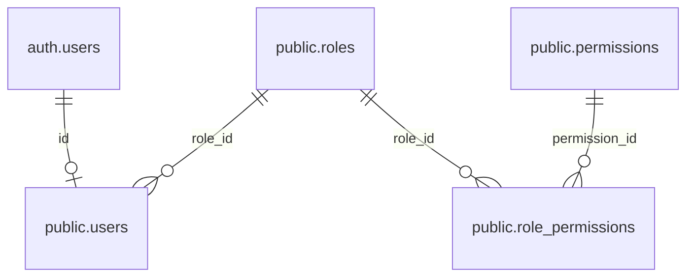
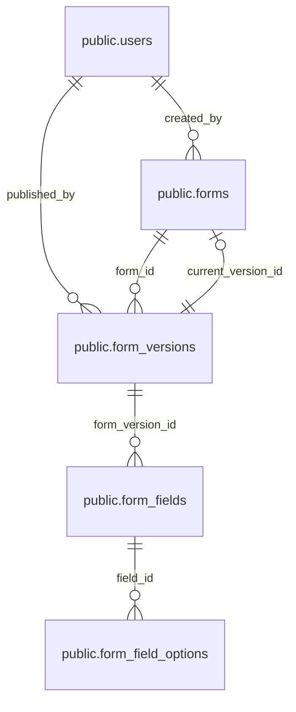
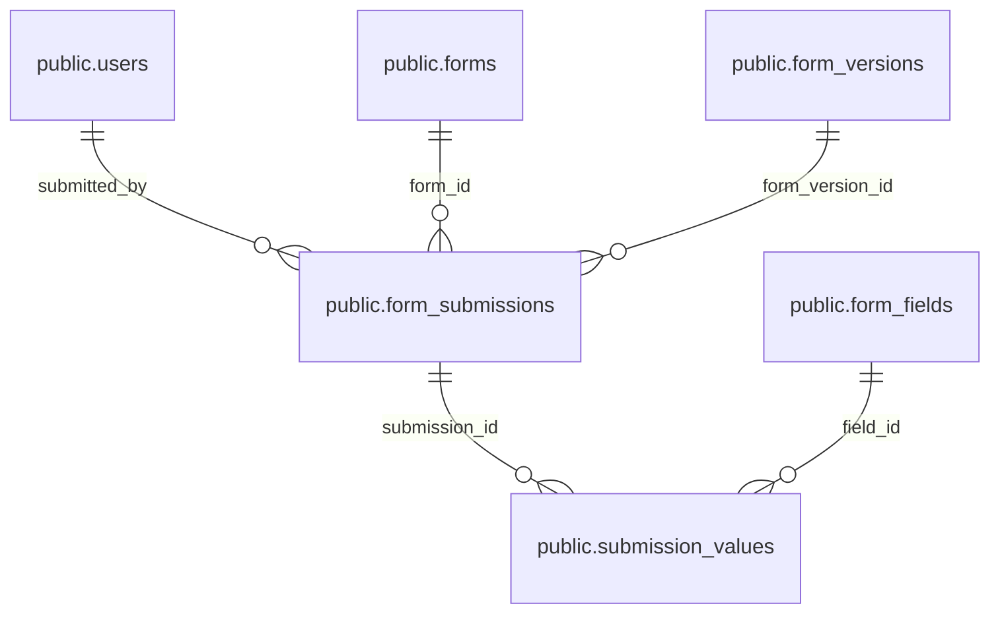
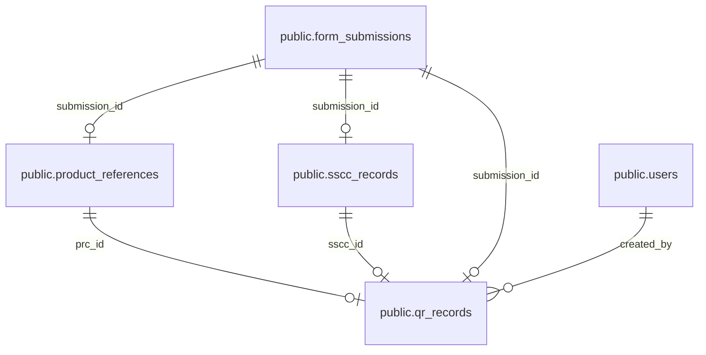
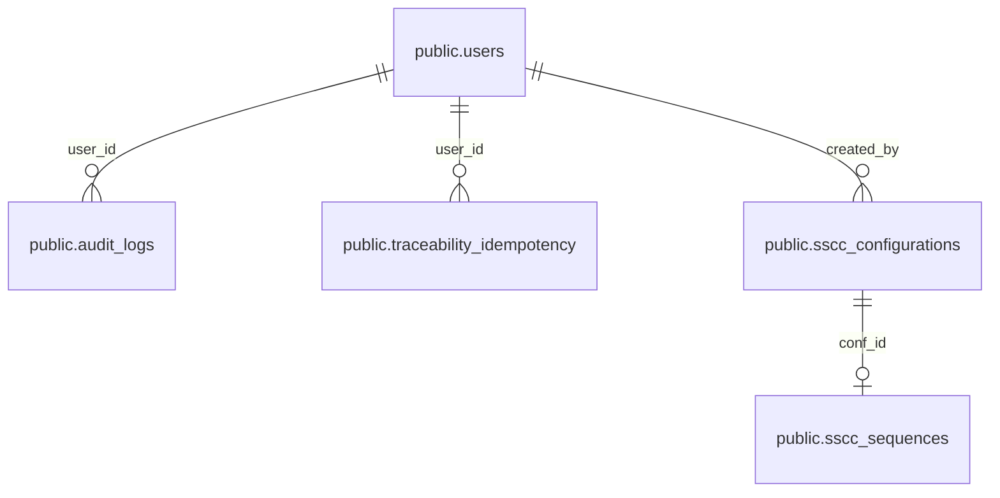

# PharmaTrace Database Relationship Map

## Core Identity & RBAC

```mermaid
erDiagram
    "auth.users" ||--o| "public.users" : "id"
    "public.roles" ||--o{ "public.users" : "role_id"
    "public.roles" ||--o{ "public.role_permissions" : "role_id"
    "public.permissions" ||--o{ "public.role_permissions" : "permission_id"
```

## Form Engine Architecture

```mermaid
erDiagram
    "public.users" ||--o{ "public.forms" : "created_by"
    "public.users" ||--o{ "public.form_versions" : "published_by"
    
    "public.forms" ||--o{ "public.form_versions" : "form_id"
    "public.form_versions" ||--o| "public.forms" : "current_version_id"
    
    "public.form_versions" ||--o{ "public.form_fields" : "form_version_id"
    "public.form_fields" ||--o{ "public.form_field_options" : "field_id"
```

## Submissions & Values

```mermaid
erDiagram
    "public.users" ||--o{ "public.form_submissions" : "submitted_by"
    "public.forms" ||--o{ "public.form_submissions" : "form_id"
    "public.form_versions" ||--o{ "public.form_submissions" : "form_version_id"
    
    "public.form_submissions" ||--o{ "public.submission_values" : "submission_id"
    "public.form_fields" ||--o{ "public.submission_values" : "field_id"
```

## Traceability & Serialization

```mermaid
erDiagram
    "public.form_submissions" ||--o| "public.product_references" : "submission_id"
    "public.form_submissions" ||--o| "public.sscc_records" : "submission_id"
    
    "public.product_references" ||--o| "public.qr_records" : "prc_id"
    "public.sscc_records" ||--o| "public.qr_records" : "sscc_id"
    "public.form_submissions" ||--o| "public.qr_records" : "submission_id"
    "public.users" ||--o{ "public.qr_records" : "created_by"
```

## System Configuration & Audit

```mermaid
erDiagram
    "public.users" ||--o{ "public.audit_logs" : "user_id"
    "public.users" ||--o{ "public.traceability_idempotency" : "user_id"
    
    "public.sscc_configurations" ||--o| "public.sscc_sequences" : "conf_id"
    "public.users" ||--o{ "public.sscc_configurations" : "created_by"
```
